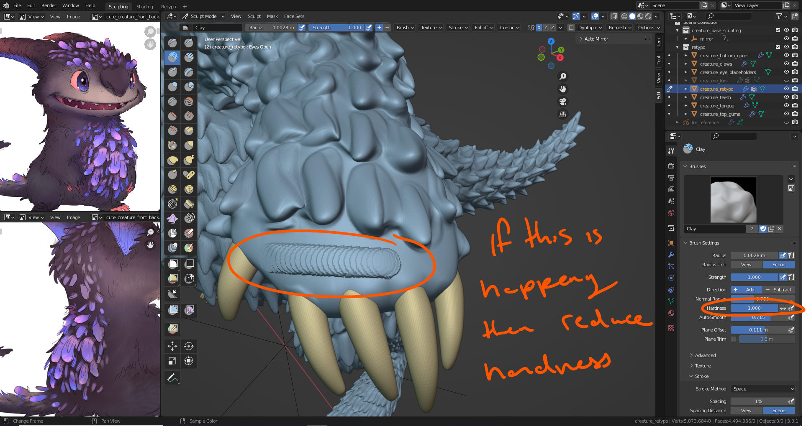
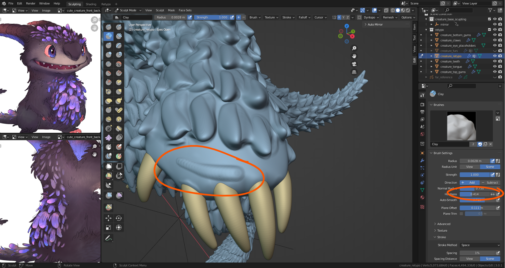
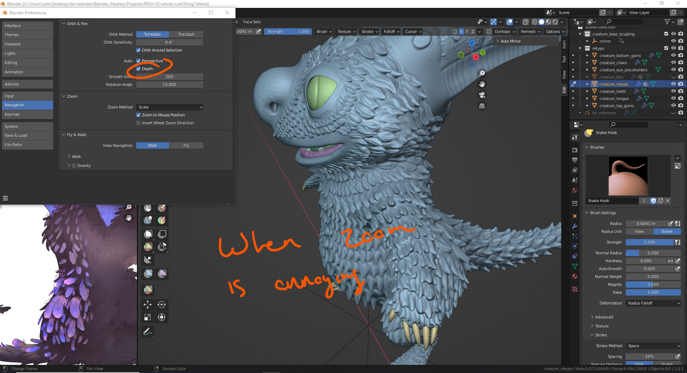

# DEV-44, Back Pack Part 1
### Tags: [cloth workflow, spacing, zoom]
### Link: <https://academy.cgboost.com/courses/master-3d-sculpting-in-blender/lectures/33242265>

## Troubleshooting: Spacing/Hardness

## Troubleshooting: Zoom

## Creating the Backpack